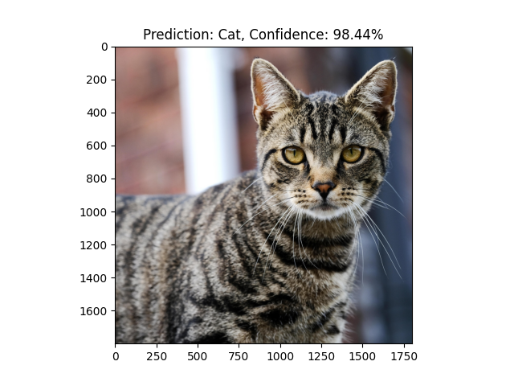
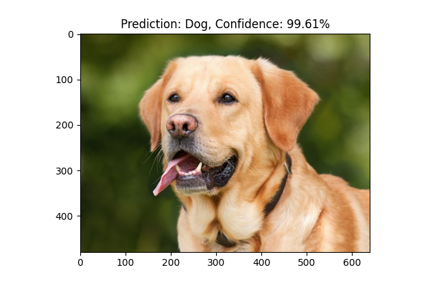
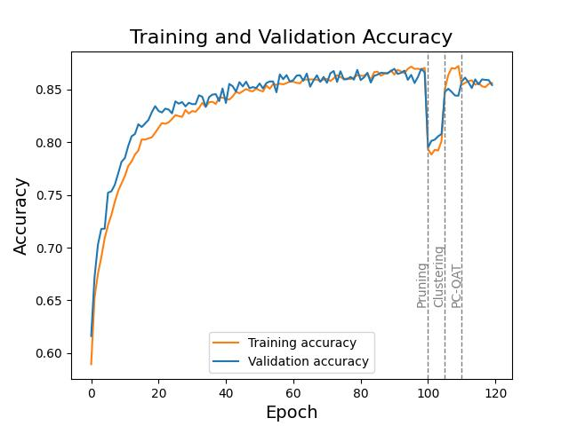

# tf-model-optimizations

A demo project showcasing deep learning optimizations for extremely low resource devices. The end result is a model that can classify between pictures of cats and dogs with >85% accuracy, while only occupying 3 *kilobytes* of storage.

  
  

The main areas of optimization are:

**1. Hyperparameter tuning** to reduce the number of parameters while maintaining as much accuracy as possible.  
**2. Combined train-time and post-training optimizations** such as pruning, clustering and quantization.  
**3. Storing the model in its compressed form**, and decompressing directly into memory at runtime.

## Setup

This repository requires Python 3.9 or newer. Install the required packages with `pip install -r requirements.txt`.

The following scripts are provided:

- `model_train.py` to train a model, convert it to the TFLite model and store it as a zipped file.  
- `model_inference.py` to test the model inside the zipped file against a directory of images.

*Note:* For GPU support which speeds up training significantly, install TensorFlow 2.8.1 using the [official instructions](https://www.tensorflow.org/install/pip) before installing the rest of the requirements.
